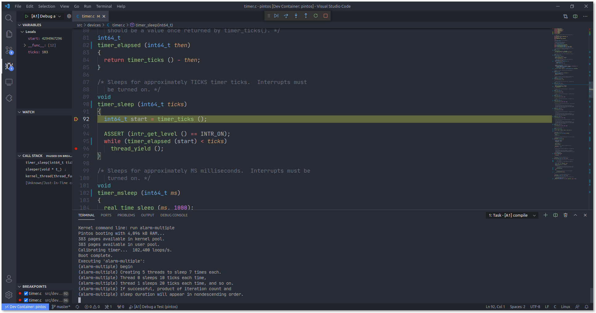

# Pintos Dev Container

A VSCode dev container enables you to use VSCode GUI to debug Pintos with GDB.



## Get Started

* Make sure Docker, VSCode and [Remote Development Extension Pack](https://marketplace.visualstudio.com/items?itemName=ms-vscode-remote.vscode-remote-extensionpack) are installed
* Press [Use this template](https://github.com/LiangLouise/pintos_dev_container/generate) to create your own repository and then clone it
* Choose `Reopen in Container` in VScode. For details refer this [tut](https://code.visualstudio.com/docs/remote/containers#_quick-start-open-an-existing-folder-in-a-container)
* Wait for container to be pulled.
* After the new VSCode window pops out, then you are good to go

Note: If you are using Windows + WSL2, please ensure EOL is set to be `LF` for all text files, otherwise shell scripts won't be executed normally when docker building the image. This can be done by updating the config of git `core.autocrlf`. For details, please follow this [post](https://stackoverflow.com/a/13154031).

## Debug Tests with VSCode

### Basic Guide

#### Project 1

* Insert breakpoints to the lines you want to debug
* Go to `Run and Debug` tab, select the configurations `[P1] Debug a Test`, and press play button
* Wait for compiling and in the prompt box and type the test name, e.g., `alarm-multiple`, you want to debug

#### Project 2 and following

since we need load user programs and pass arguments to them: 

* Insert breakpoints to the lines you want to debug
* Go to `Run and Debug` tab, select the configurations for the test you are working on, and press play button	

As many tests from Project 2 require multiple user programs (e.g., `exec-arg`) to be loaded, it would be more convinient for you to write the task for the testcase you are having troubles with so you can replay it quickly. See section [Debug a Specific Test](#Debug-a-Specific-Test)

I left some examples for each project, so you can refer to them and write your owns. You will need to modify the arguments and working directory of the compile and run tasks in [tasks.json](./.vscode/tasks.json) to fit your need. And you also need update the entires `program` and `setupCommands` in the [launch.json](.vscode/launch.json) to points to the `kernerl.o` you want to test and ask GDB to load usersymbols.

### Debug a Specific Test

You could copy the pintos cmd from `make grade` to see how grader run the test and create a new task and launch job.

For example, in project 3, if you want to debug `page-parallel`, see comments in the code snippet to find what entires need update:

<details>
	<summary><code>launch.json/configurations</code></summary>
	
```json

{
	// The name of the launch job
    "name": "[P3] Debug page-parallel",
    "type": "cppdbg",
    "request": "launch",
	// Set the kernel.o you are working on
    "program": "${workspaceFolder}/src/vm/build/kernel.o",
	// Set the current test's running task in tasks.json
    "preLaunchTask": "[P3] Run child-linear",
    "miDebuggerServerAddress": "localhost:1234",
    "stopAtEntry": false,
    "cwd": "${workspaceFolder}/src",
    "environment": [],
    "externalConsole": false,
    "MIMode": "gdb",
	//  set paths in loadusersymbols to the programs used in this test
    "setupCommands": [
	{
	    "description": "Enable pretty-printing for gdb",
	    "text": "-enable-pretty-printing",
	    "ignoreFailures": true
	},
	{
	    "text": "source -v ${workspaceFolder}/src/misc/gdb-macros",
	    "description": "Import Pintos GDB macros file",
	    "ignoreFailures": false
	},
	{
	    "text": "loadusersymbols ${workspaceFolder}/src/vm/build/tests/vm/child-linear",
	    "description": "Import user program",
	    "ignoreFailures": false
	},
	{
	    "text": "loadusersymbols ${workspaceFolder}/src/vm/build/tests/vm/page-parallel",
	    "description": "Import user program",
	    "ignoreFailures": false
	}
    ],
    "symbolLoadInfo": {
	"loadAll": true,
	"exceptionList": ""
    }
}
```

</details>

and 

<details>
	<summary><code>tasks.json/tasks</code></summary>
	
```json

{
    "label": "[P3] compile",
    "type": "shell",
    "command": "make",
    "options": {
	"cwd": "${workspaceFolder}/src/vm"
    }
},
{
	// The name of the running task
    "label": "[P3] Run child-linear",
    "type": "shell",
    "isBackground": true,
    "problemMatcher": [
	{
	    "pattern": [
		{
		    "regexp": ".",
		    "file": 1,
		    "location": 2,
		    "message": 3
		}
	    ],
	    "background": {
		"activeOnStart": true,
		"beginsPattern": ".",
		"endsPattern": ".",
	    }
	}
    ],
	// Set the current project's build task
    "dependsOn": [
	"[P3] compile"
    ],
	// Copy pintos cmd and add flag --gdb
    "command": "pintos -v -k -T 60 --gdb --filesys-size=2 -p tests/vm/page-parallel -a page-parallel -p tests/vm/child-linear -a child-linear --swap-size=4 -- -q  -f run page-parallel",
    "options": {
		// Set the current test's working task
		"cwd": "${workspaceFolder}/src/vm/build"
    }
}
```
	
</details>
	
For details about how to write your own `tasks.json` and `launch.json`, please refer to the docs of VSCode.

### User-defined Macros

To use user-defined Macros in [E.5.1 Using GDB](https://thierrysans.me/CSCC69/projects/WWW/pintos_10.html#SEC152), you can open the debug console tab and type the command in the panel with prefix `-exec`. For example, to run command `dumplist`, type `-exec dumplist &all_list thread allelem` and press Enter.

## Working With Existing Pintos Repo

If you have already cloned the repo from [CSCC69-Pintos](https://github.com/ThierrySans/CSCC69-Pintos), to enable using devcontainer and debug in VSCode:

* Copy the entire directory [.vscode](./vscode) and [.devcontainer](./devcontainer) to the root of your repo;
* If you are using image `thierrysans/pintos` pulled from dockerhub, replace the variable [image](https://github.com/LiangLouise/pintos_dev_container/blob/master/.devcontainer/devcontainer.json#L5) in devcontainer.json with `thierrysans/pintos`.

Note that Clang-Format won't work if your dockerfile or image doesn't have `clang-format` installed.

## Formatting

The formatting style of Pintos as recommended in the [Coding Standards](https://thierrysans.me/CSCC69/projects/WWW/pintos_8.html#SEC138) is GNU style. Thus this dev container uses [clang-format](https://clang.llvm.org/docs/ClangFormat.html) to format the source code automatically via. a VSCode extension [Clang-Format](https://marketplace.visualstudio.com/items?itemName=xaver.clang-format).

You may override the settings in [settings.json](./.vscode/settings.json) to disable formatting on save or change the formatter. You may also change the formatting style in the config file [.clang-format](./.clang-format) as your preference.

## References

* [Debug Pintos using GDB](https://thierrysans.me/CSCC69/projects/WWW/pintos_10.html#SEC151)

* [VSCode C/C++ Debug](https://code.visualstudio.com/docs/cpp/cpp-debug)

* [Debug helloworld.cpp](https://code.visualstudio.com/docs/cpp/config-linux#_debug-helloworldcpp)
